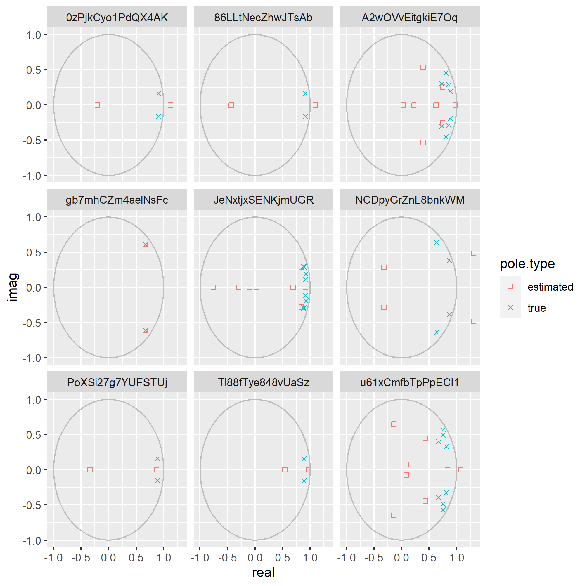
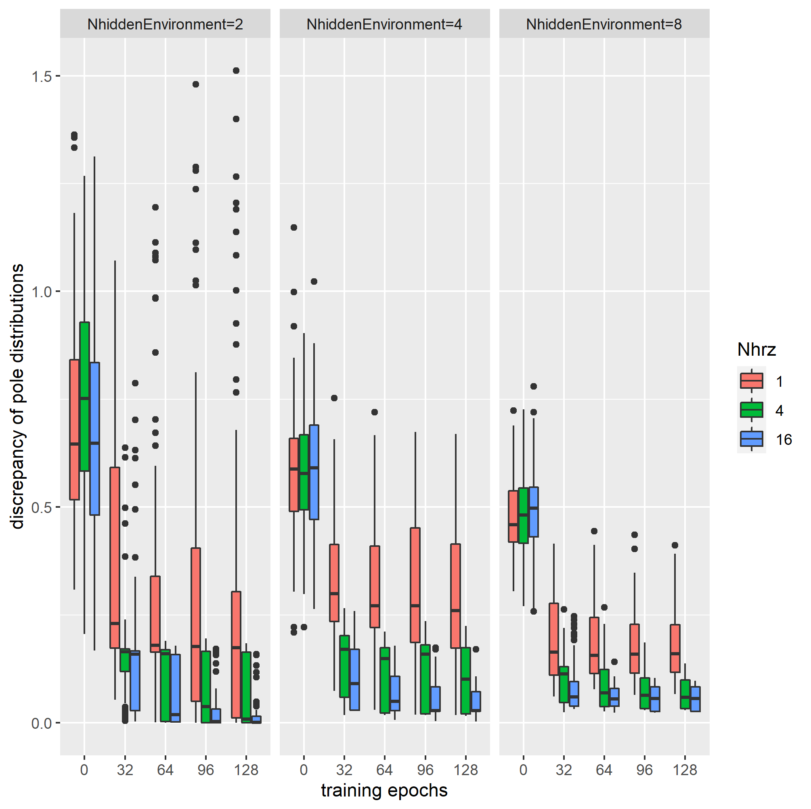
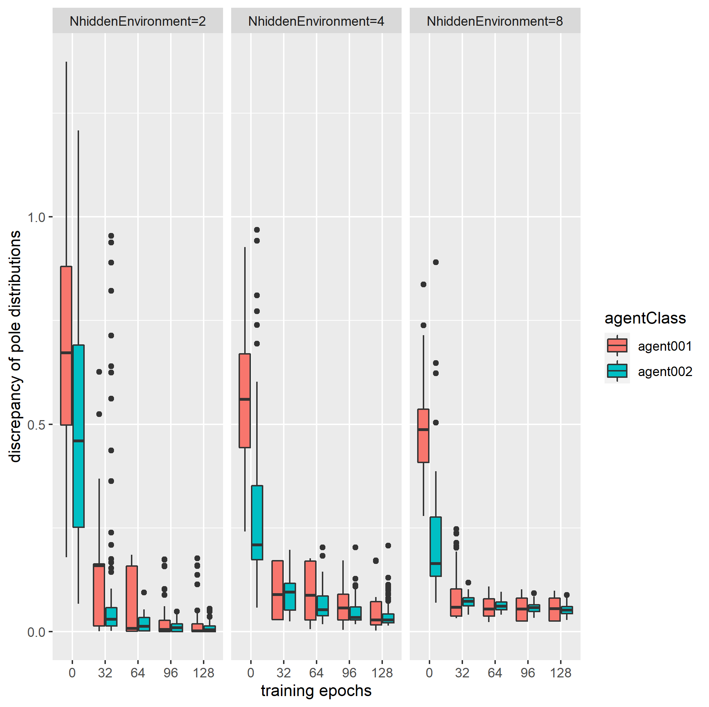

# 1. Introduction

Pole distribution is a feature to characterise the linear time-invariant (LTI) system.
According to the pole distribution of the system,
the different dynamism is observed in the time scaled trend.

Linearly recurrent network (LRN) system is a branch
of the sequential model in the machine learning.
Networks can be trained base on datasets 
by using machine learning algorithms.

We study empirically how trained LRN systems
estimate the pole distribution of targeted LTI systems
and how to improve the estimation by tuning training hyperparameters.

# 2. Specifications

## 2.1. Agent's parameterization

The LTI system of agent is parameterised in the following ways.
The parameterization of agent can be selected by the hyperparameter as shown in the table 2.1.1.

Table 2.1.1. the pair of the hyperparameter and the agent realization
|agentClass| agent realization |
|-|-|
|agent001| general representation |
|agent002| diagonal canonical form |

### general representation

Here is the representation of agent.

Note that `x(t),u(t) and y(t)` are state variable, input variable and output varible, respectively,
and that `A, B and C` are trained by using the machine learning technique.

### diagonal canonical form

The dynamism of agents are represented as follows:

We supposed that `n` is a even number 
and that `alpha_{i} and beta_{i} (i=1...n/2)` are initialized randomly, subject to the following equation:

Note that `d` denotes the initial damping constant as a given parameter.

`alpha_{i}, beta_{i} (i=1...n/2), B and C` are trained by using the machine learning technique.

## 2.2. loss function

Agents are trained by the following criteria:

,where `y(t)` denotes the observation at the time `t` 
and `yhat(t|s)` denotes the prediction at the time `t (t>s)`
given the observation at the time `s` and the input series between `s` and `t`.
The time span between `s` and `s + Nhrz` is called in this text the prediction horizon 
at the query of prediction at the time `s`. And the `Nhrz` is a given hyperparameter.

## 2.3. targeted environments

Our targeted environments are also LTI systems.
They follow the following specifications.
- The poles are distributed on the edge of the unit circle, 
which means that the environments react to the input with the longer time constant than the sampling interval.
The margin between the edge of pole distribution is controlled by the boundry of the time constant.
- The input to the environments are the white noise in order to satisfy the persistent excitation condtion.
- The dimension of observation is equal with the one of state variable in order to avoid the difficulty of the partial observation.

The environments are controlled by the following hyperparameters:

|parameter|description|options|
|-|-|-|
|`NhiddenEnvironment`| dimension of state variable | 2, 4 and 8 |
|`Ninput`| dimension of input | 1 |
|`T0`| the lower bound of time constant | 4 |
|`T1`| the lower bound of time constant | 32 |
|`seed`| the seed of the random stream for the parameter initialization | 0, 1 and 2|

# 3. Case studies

## 3-1. Case study #1:

In this case study,
LRN systems were trained by using the hyperparameters in the table 3.1.1.

The figure 3.1.1 shows the learning curves
of the discrepancy between the true pole distribution
and the estimated one defined as follows:

The figure 3.1.1 tells us that the estimated errors have converted 
at the end of training iterations.

The figure 3.1.2 shows some examples of the pair of
the targeted pole distribution and the trained one,
which are selected randomly among the trained networks.
It can be seen that all the poles are missed
and that estimated poles are not always but sometimes located beyond the unit circle,
which means that the estimated LRN system might be unstable.

Table 3.1.1 Hyper parameters
| parameter | description | value |
|-|-|-|
| `agentClass` | agent realization | general representation |
| `Nhrz` | length of prediction horizon | 1 |
| `NhiddenAgent` | dimension of agent | equals with the environment dimension |

Figure 3.1.1 Learning curves of the discrepancy between the true pole distribution and the estimated one

Figure 3.1.2 Targeted pole distributions and trained ones

## 3-2. Case study #2:

Generally speaking,
time constant of environment
is longer than sampling interval.
It implies that if an agent is allowed to see the prediction at only the next step,
it's hard for the agent to learn from the entire response of the environment.
Thus, the prediction horizon should be similar to or longer than
the time constant of the environment.

In this case study,
we select the prediction horizon among the options of 1,4 and 16,
as shown in the table 3.2.1,
since the targeted environment has time constants distributed between 4 and 32.

Figure 3.2.1 shows the learning curves
of the pole distribution discrepancy defined in the case study 1.
It's confirmed that
- the discrepancy have almost converged at the end of the training iterations,
- and the mismatches of the pole distribution decrease as the length of the prediction horizon gets longer.

Figure 3.2.2 shows some examples of pole distributions of randomly selected trained agents.
Some poles of trained systems match with the poles of targeted system
or are located in the center of groups of the targeted poles as if they represented the groups.
The rest of poles of the trained systems are apart from the unit circle,
this means that the trained system lost partially the capacity
to estimate long-term behaviour of the targeted system.

Table 3.2.1 Hyper parameters
| parameter | description | value |
|-|-|-|
| `agentClass` | agent realization | general representation |
| `Nhrz` | length of prediction horizon | 1, 4 or 16|
| `NhiddenAgent` | dimension of agent | equals with the environment dimension |

Figure 3.2.1 Learning curves of the discrepancy between the true pole distribution and the estimated one

Figure 3.2.2 Targeted pole distributions and trained ones

## 3-3. Case study #3:

As mentioned in the discussion of the case study #2,
trained system can have poles apart from the edge of the unit circle.
The poles near the center represent the short term response of the linear system.
Our target system has the long term response, in another words,
the poles of the targeted system are distributed over the edge of the unit circle.
However, the sytem matrix of agent initialized randomly can not have such a pole distribution.
Therefore, this case study manipuluates the initial pole distribution
by exploiting the diagnal canonical form of the linear system.

The training parameters are shown in the table 3.3.1.

The figure 3.3.1 show the learning curves of the performance defined in the case study 1.
Thanks for the random allocation of the initial poles on the edge of the unit circle,
the performances converge faster than the agents with the system matrix initialized randomly. 
Furthermore, the variance of the error is shrank, though,
the average performance does not has big difference between two types of agents.
The latter is understandable since it's normal that neither the diffrent expressions of the system
nor the different initialization of the poles
can improve the estimation capacity of the pole distribution.

The figure 3.3 shows some examples of estimated pole distribution.
In so much as these examples,
there is no unrelevant poles of the trained system.
No pole is located apart from the unit circle
or from the targeted pole distribution.

Figure 3.3.1 Learning curves of the discrepancy between the true pole distribution and the estimated one

Figure 3.3.2 Targeted pole distributions and trained ones
