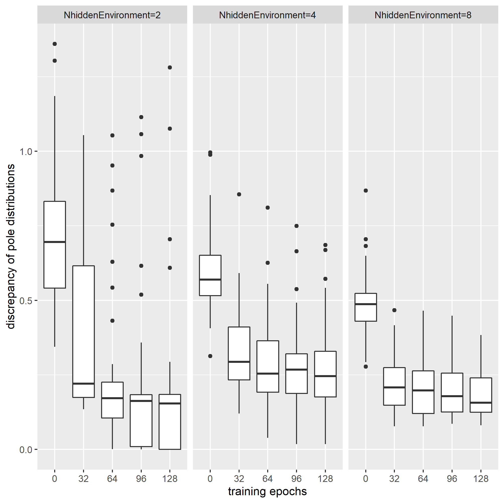
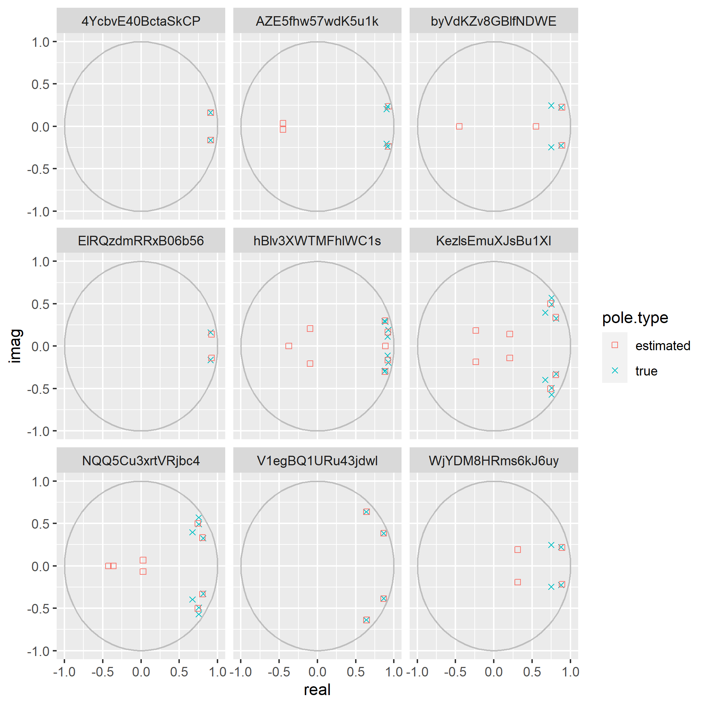

# 1. Introduction

Pole distribution is a feature to characterise the linear time-invariant (LTI) system.
According to the pole distribution of the system,
the different dynamism is observed in the time scaled trend.

Linearly recurrent network (LRN) system is a branch
of the sequential model in the machine learning.
Networks can be trained base on datasets 
by using machine learning algorithms.

We study empirically how trained LRN systems
estimate the pole distribution of targeted LTI systems
and how to improve the estimation by tuning training hyperparameters.

# 2. Specifications

## loss function

Agents are trained by the following criteria:

,where `y(t)` denotes the observation at the time `t` 
and `yhat(t|s)` denotes the prediction at the time `t (t>s)`
given the observation at the time `s` and the input series between `s` and `t`.
The time span between `s` and `s + Nhrz` is called the prediction horizon 
at the query of prediction at the time `s`

# 3. Case studies

editing

## 3-1. Case study #1:

In this case study,
LRN systems were trained by using the hyperparameters in the table 3.1.1.
The figure 3.1.1 shows the learning curves
of the discrepancy between the true pole distribution
and the estimated one defined as follows:

It's confirmed that the estimated errors have converted 
at the end of training iterations.

The figure 3.1.2 shows some examples of the pair of
the targeted pole distribution and the trained one,
which are selected randomly among the trained networks.
It can be seen that all the poles are missed
and that estimated poles are not always but sometimes located beyond the unit circle,
which means that the estimated LRN system might be unstable.

Figure 3.1.1 Learning curves of the discrepancy between the true pole distribution and the estimated one

Figure 3.1.2 Targeted pole distributions and trained ones

## 3-2. Case study #2:

Generally speaking,
time constant of environment
is longer than sampling interval,
which implies that
, if an agent is allowed to see the prediction at the next step,
it might be hard for the agent to learn the entire response of the environment.
Intuitively, the prediction horizon should be similar to or longer than
the time constant of the environment.

In this case study,
we choose the prediction horizon among the options of 1,4 and 16,
as shown in the table 3.2.1,
since the targeted environment has time constants distributed between 4 and 32.

Figure 3.2.1 shows the learning curves
of the pole distribution discrepancy, already  mentioned in the case study 1.
It's confirmed that
- the discrepancy have almost converged at the end of the training iterations,
- and the mismatches of the pole distribution reduce depending on the length of the prediction horizon.

Figure 3.2.2 show some examples of pole distributions of randomly selected trained agents.
Some poles of trained systems match with the poles of targeted system
or are located in the center of groups of the targeted poles as if they represented the groups.
The rest of poles of the trained systems are apart from the unit circle,
this means that the trained system does not have the capacity
to estimate long-term behaviour of the targeted system.

Figure 3.2.1 Learning curves of the discrepancy between the true pole distribution and the estimated one

Figure 3.2.2 Targeted pole distributions and trained ones